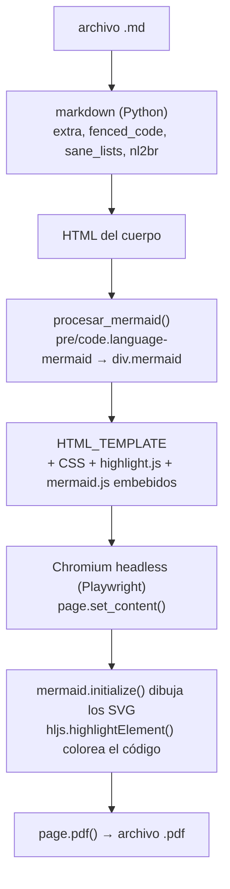

# Arquitectura

## El flujo, de principio a fin



Todo se resuelve en un solo HTML autocontenido: los scripts y las hojas de
estilo se **incrustan como texto**, no se enlazan. Por eso el PDF se genera sin
conexión una vez que los assets están en caché, y por eso Chromium no tiene que
esperar peticiones de red.

## Las dos capas

| Capa | Archivo | Responsabilidad |
|---|---|---|
| Núcleo + CLI | [`md_to_pdf.py`](../md_to_pdf.py) | Conversión, estilos, caché de assets, argumentos de línea de comandos |
| Interfaz gráfica | [`app.py`](../app.py) | Selección de archivos, opciones, hilo de trabajo, registro visual |

`app.py` **importa** `md_to_pdf`; no duplica ni una línea de la lógica de
conversión. Cualquier mejora en el motor la reciben las dos interfaces.

### La frontera entre ambas

```python
convertir_lote(pares, css_str=None, progreso=None, cancelado=None) -> [Resultado]
```

- `pares` — lista de tuplas `(Path del .md, Path del .pdf a generar)`.
  Quien llama decide los nombres de salida; el núcleo no impone convenciones.
- `css_str` — el CSS ya leído como texto (`None` usa `DEFAULT_CSS`).
- `progreso` — callback `(indice, total, Resultado)` tras cada archivo.
- `cancelado` — callable sin argumentos; si devuelve `True` entre dos archivos,
  el lote se detiene ahí.

Devuelve una lista de `Resultado`, no un par de contadores. La diferencia
importa: **un archivo puede convertirse y aun así haber perdido algo**, y eso
hay que poder contarlo.

```python
class Resultado:
    origen, destino   # Path
    ok                # bool
    avisos            # [str]  lo que se degradó pero no impidió el PDF
    error             # str | None
```

Lanza `ErrorAssets` si no consigue mermaid/highlight. **No llama a `sys.exit()`**:
esta función la usan también la interfaz gráfica y el servicio web, donde
terminar el proceso desde dentro de una librería deja la aplicación colgada.

Funciones auxiliares del mismo módulo:

- `buscar_markdown(carpeta, recursivo)` — los Markdown de una carpeta, en las
  cuatro extensiones de `EXTENSIONES_MD`.
- `destinos_sin_colision(archivos, carpeta)` — arma los pares garantizando que
  dos archivos distintos nunca compartan destino.
- `incrustar_imagenes(html, carpeta, avisos)` — mete las imágenes locales en el
  HTML como `data:` URI.
- `asegurar_assets()` — descarga y cachea mermaid/highlight, devuelve su contenido.
- `procesar_mermaid(html)` — reescribe los bloques de código Mermaid a `div.mermaid`.

## Dos decisiones que no son obvias

### Las imágenes se incrustan, no se enlazan

Una página creada con `set_content()` tiene **origen opaco**, y Chromium le
niega la lectura de archivos locales. Con un simple `<base href="file://…">`
toda imagen del documento sale rota — comprobado. Por eso `incrustar_imagenes()`
las convierte a `data:` URI antes de renderizar.

El efecto secundario es el que queremos para taudux.com: el HTML queda
autocontenido, y el servicio web no necesita ninguna carpeta de origen.

### La red está bloqueada por omisión

`convertir_md_a_pdf(..., permitir_red=False)` intercepta todas las peticiones y
aborta las que no sean `file:`, `data:`, `blob:` o `about:`.

Sirve para tres cosas a la vez: la conversión es reproducible (nada depende de
que un CDN responda), es más rápida (se pudo cambiar `networkidle` por `load`),
y —lo importante de cara a producción— **un `.md` ajeno no puede hacer que el
navegador del servidor salga a la red**.

## Una sola instancia de Chromium

`_convertir_pares_async()` abre el navegador **una vez** y reutiliza la misma
instancia para todo el lote, creando y cerrando una pestaña por archivo. Arrancar
Chromium cuesta 1–2 segundos; convertir una página, décimas. En un lote de 30
archivos la diferencia entre reutilizar y relanzar es de casi un minuto.

Si un archivo falla, `convertir_md_a_pdf()` atrapa la excepción, devuelve
`False` y el lote continúa. Un `.md` roto no tumba la corrida entera.

## Concurrencia en la interfaz

Playwright es asíncrono; tkinter no. La conexión entre ambos:

```
Hilo de tkinter                    Hilo de trabajo (daemon)
───────────────                    ────────────────────────
iniciar_conversion()  ──lanza──▶   _trabajo_conversion()
                                     └─ convertir_lote()
                                          └─ asyncio.run(...)
                                               │
      cola_eventos  ◀──────pone tuplas────────┘
           │
_procesar_cola()  ← se re-agenda cada 100 ms con after()
      └─ actualiza barra de progreso y registro
```

`queue.Queue` es la única vía de comunicación entre hilos. La regla que sostiene
todo: **solo el hilo de tkinter toca widgets**. El hilo de trabajo nunca escribe
en la interfaz, solo encola eventos (`avance`, `fin`, `error`).

`asyncio.run()` dentro de un hilo secundario crea su propio bucle de eventos, así
que no interfiere con nada más.

## Caché de assets

`asegurar_assets()` guarda en `%USERPROFILE%\.md_to_pdf_assets`:

| Archivo | Para qué |
|---|---|
| `mermaid.min.js` (10.9.0) | Renderiza los diagramas |
| `highlight.min.js` (11.9.0) | Resalta la sintaxis |
| `vs2015.min.css` | Tema base de highlight.js |

Se descargan la primera vez y se leen de disco después. Vive en el perfil del
usuario, no en el proyecto: se comparte entre copias y sobrevive a un `git clean`.

## Por qué Chromium y no una librería de PDF

El proyecto pasó por cuatro motores antes de llegar aquí; el detalle está en
[HISTORIAL.md](HISTORIAL.md). El resumen: Mermaid **es** JavaScript. Genera SVG
ejecutándose en un navegador. Cualquier motor sin motor de JavaScript —
WeasyPrint, xhtml2pdf, ReportLab — puede maquetar bonito, pero jamás va a
dibujar un diagrama Mermaid. Una vez que renderizar diagramas era un requisito,
el navegador headless dejó de ser una opción y pasó a ser la única salida.

El costo: Chromium pesa ~150 MB y hay que instalarlo aparte. A cambio se obtiene
CSS moderno completo, JavaScript y tipografía de calidad, sin mantener nada.
