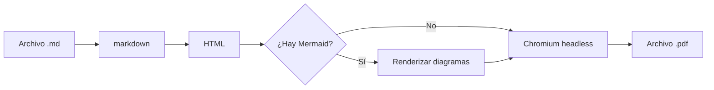

# Documento de Prueba

Este es un archivo Markdown de ejemplo para probar la conversión a PDF.

## Características probadas

Aquí podemos ver diferentes elementos de Markdown convertidos con estilos bonitos.

### Listas

- Primer elemento
- Segundo elemento
    - Sub-elemento
    - Otro sub-elemento
- Tercer elemento

### Lista numerada

1. Paso uno
2. Paso dos
3. Paso tres

### Código

Ejemplo de código inline: `print("Hola mundo")`

Bloque de código:

```python
def saludar(nombre):
    """Función simple de saludo."""
    return f"Hola, {nombre}!"

print(saludar("Claude"))
```

### Tabla

| Lenguaje   | Año  | Creador           |
|------------|------|-------------------|
| Python     | 1991 | Guido van Rossum  |
| JavaScript | 1995 | Brendan Eich      |
| Rust       | 2010 | Graydon Hoare     |

### Cita

> "La simplicidad es la máxima sofisticación."
> — Leonardo da Vinci

### Diagrama Mermaid



### Enlaces

Visita el [sitio de Python](https://www.python.org) para más información.

## Conclusión

Este documento demuestra que el conversor maneja correctamente los elementos
comunes de Markdown.
